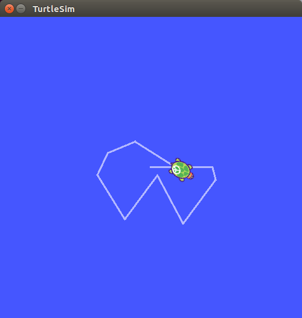
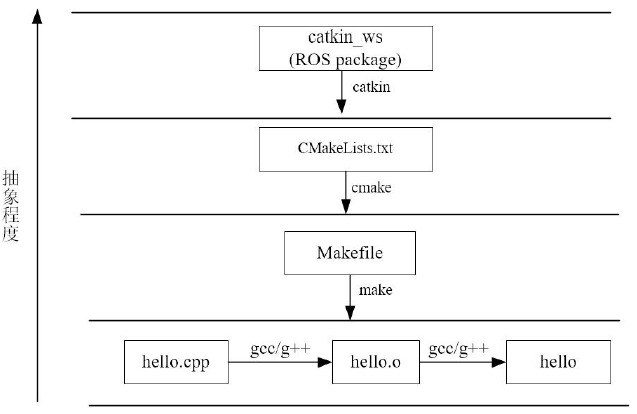
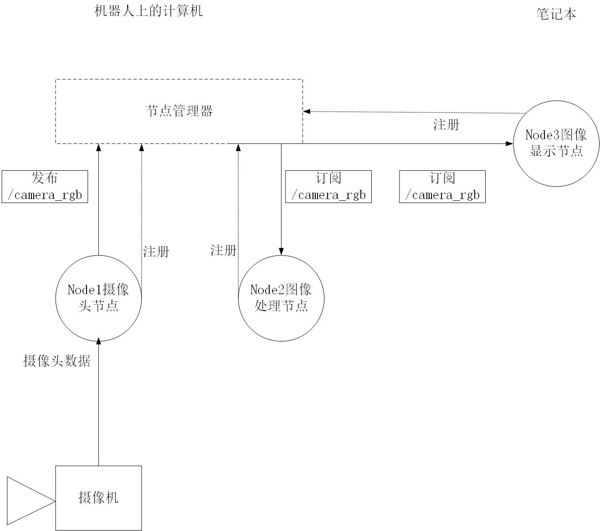

# ROS参考手册

[TOC]

---

## 预-ROS简介

### ROS的构成和特点

机器人是一个系统工程，它涉及机械、电子、控制、通信、软件等诸多学科。以前，开发一个机器人需要花很大的功夫，你需要设计机械、画电路板、写驱动程序、设计通信架构、组装集成、调试、以及编写各种感知决策和控制算法，每一个任务都需要花费大量的。。。。。。。。。。。。。。。。。。。。。。。。。。。。。。。。。。。。。。。。。。。。。。。。。。。。。。。。。。。。。。时间。因此像电影《钢铁写》中那样，仅靠一个人的力量造出一个动力超强的人形机器人机甲是不可能的。

然而随着技术进步，机器人产业分工开始走向细致化、多层次化，如今的电机、底盘、激光雷达、摄像头、机械臂等等元器件都有不同厂家专门生产。社会分工加速了机器人行业的发展。而各个部件的集成就需要一个**统一**的**软件平台**，在机器人领域，这个平台就是机器人操作系统ROS。

ROS是一个适用于机器人编程的**框架**，这个框架把原本松散的零部件耦合在了一起，为他们提供了**通信架构**。ROS虽然叫做**操作系统**，但并非Windows、Mac那样通常意义的操作系统，它只是连接了操作系统和你开发的ROS应用程序，所以它也算是一个**中间件**，基于ROS的应用程序之间建立起了沟通的桥梁，所以也是运行在Linux上的**运行时环境**，在这个环境上，机器人的感知、决策、控制算法可以更好的组织和运行。

以上几个关键词（框架、中间件、操作系统、运行时环境）都可以用来描述ROS的特性，作为初学者我们不必深究这些概念，随着你越来越多的使用ROS，就能够体会到它的作用。

**ROS具有这些特点：**

- **分布式 点对点**

  ROS采用了分布式的框架，通过点对点的设计让机器人的进程可以分别运行，便于模块化的修改和定制，提高了系统的容错能力。

- **多种语言支持**

  ROS支持多种编程语言。C++、Pyhton和已经在ROS中实现编译，是目前应用最广的ROS开发语言，Lisp、C#、Java等语言的测试库也已经实现。为了支持多语言编程，ROS采用了一种语言中立的接口定义语言来实现各模块之间消息传送。通俗的理解就是，ROS的通信格式和用哪种编程语言来写无关，它使用的是自身定义的一套通信接口。

  

- **开源社区**

  ROS具有一个庞大的社区ROS WIKI(http://wiki.ros.org/ )，这个网站将会始终伴随着你ROS开发，无论是查阅功能包的参数、搜索问题还是。当前使用ROS开发的软件包已经达到数千万个，相关的机器人已经多达上千款。此外，ROS遵从BSD协议，对个人和商业应用及修改完全免费。这也促进了ROS的流行。

### ROS的安装

ROS系统的运行依托于**操作系统**，首先需要确定所安装的ROS版本和对应的操作系统支持关系。

本篇采用的操作系统为ROS-kinetic，访问链接（http://wiki.ros.org/kinetic/Installation），支持列表中的系统有各个芯片平台下的Ubuntu，进入安装方式（http://wiki.ros.org/kinetic/Installation/Ubuntu）后可以看到：

```
1.Installation

ROS Kinetic ONLY supports Wily (Ubuntu 15.10), Xenial (Ubuntu 16.04) and Jessie (Debian 8) for debian packages. 
```

所以最适合的系统为Ubuntu16.04（http://releases.ubuntu.com/16.04/ubuntu-16.04.6-desktop-amd64.iso）

确认系统之后即可按照WIKI上ROS安装页的步骤进行安装，也可以按照下面的安装过程安装。

1. **添加源**

   在命令行输入：

   ```
   sudo sh -c '. /etc/lsb-release && echo "deb http://mirrors.ustc.edu.cn/ros/ubuntu/ $
   DISTRIB_CODENAME main" > /etc/apt/sources.list.d/ros-latest.list'
   ```

   添加的源与官网不同，为国内源。

2.  **添加keys**

   ```
   sudo apt-key adv --keyserver hkp://ha.pool.sks-keyservers.net:80 --recv-key 421C365B
   D9FF1F717815A3895523BAEEB01FA116
   ```

   公钥是Ubuntu系统的一种安全机制，也是ROS安装中不可缺的一部分，如果镜像系统则需要重新进行此步骤。

3.  **系统更新**

   ```
   sudo apt-get update && sudo apt-get upgrade
   ```

   这一步会更新出第一步源内的包。

4. **安装ROS**

   ROS所关联的包非常多，除了核心部件以外还有大量的应用包配件。比如GUI，仿真，控制等等。建议直接安装桌面完整版。

   ```
   sudo apt-get install ros-kinetic-desktop-full
   ```

   如果想要知道到底有多少包可用，可以尝试以下命令：

   ```
   apt-cache search ros-kinetic
   ```

   注意: ros-kinetic-desktop-full并不包含**全部**的包

   5.**配置ROS系统环境**

   首先是系统依赖。ROS系统本身并不需要更多依赖，但是编译需要。

   ```
   sudo rosdep init && rosdep update
   ```
   
   然后是环境变量。
   
   ```
   echo "source /opt/ros/kinetic/setup.bash" >> ~/.bashrc
   ```
   
   最后建议安装ROS专用的一个编辑器rosinstall
   
   ```
   sudo apt-get install python-rosinstall
   ```

###    测试和例程

   首先在命令行输入 

   ```python
   roscore
   ```

出现输出结果最后显示为：

```
started core service [/rosout]
```

则表明安装成功。

接着我们测试ROS的吉祥物--小海龟，来简单的测试ROS运行是否正常，同时也来体验一下ROS的神奇与精彩！

启动roscore后，重新打开一个终端窗口，输入：

```
$ rosrun turtlesim turtlesim_node
```

你还看到一只萌萌的海龟出现在屏幕上，那么该怎么样来操纵这只小海龟呢？重新打开新的一个终端,输入:

```
$ rosrun turtlesim  turtle_teleop_key
```

将鼠标聚焦在第三个终端窗口上，然后通过键盘上的方向键，进行操作小海龟，如果小海龟正常移动，并且在屏幕上留下自己的移动轨迹，如下图。恭喜你，ROS已经成功的安装、配置并且运行！



至此，ROS的安装、配置与测试就全部结束了，下面就正式开启ROS精彩的旅程！

---

## 1.ROS文件系统

### catkin

对于源代码包，我们只有编译才能在系统上运行。而Linux下的编译器有gcc、g++，随着源文
件的增加，直接用gcc/g++命令的方式显得效率低下，人们开始用Makefile来进行编译。然而
随着工程体量的增大，Makefile也不能满足需求，于是便出现了Cmake工具。CMake是对
make工具的生成器，是更高层的工具，它简化了编译构建过程，能够管理大型项目，具有良
好的扩展性。对于ROS这样大体量的平台来说，就采用的是CMake，并且ROS对CMake进行
了扩展，于是便有了Catkin编译系统。



- Catkin沿用了包管理的传统结构，如 `find_package()` , `pkg-config`
- 扩展了CMake，例如
  - 软件包编译后无需安装就可使用
  - 自动生成 `find_package()` 代码， `pkg-config` 文件
  - 解决了多个软件包构建顺序问题

- 一个Catkin的软件包（package）必须要包括两个文件:
  - package.xml 

     包括了package的描述信息,包括：

    ​      name, description, version, maintainer(s), license
    ​      opt. authors, url's, dependencies, plugins, etc

  - CMakeLists.txt

    构建package所需的CMake文件

    ​      调用Catkin的函数/宏
    ​      解析 `package.xml`
    ​      找到其他依赖的catkin软件包
    ​      将本软件包添加到环境变量

#### Catkin工作原理

catkin编译的工作流程如下：

1. 首先在工作空间`catkin_ws/src/`下递归的查找其中每一个ROS的package。
2. package中会有`package.xml`和`CMakeLists.txt`文件，Catkin(CMake)编译系统依据`CMakeLists.txt`文件,从而生成`makefiles`(放在`catkin_ws/build/`)。
3. 然后`make`刚刚生成的`makefiles`等文件，编译链接生成可执行文件(放在`catkin_ws/devel`)。

也就是说，Catkin就是将`cmake`与`make`指令做了一个封装从而完成整个编译过程的工具。catkin有比较突出的优点，主要是：

- 操作更加简单
- 一次配置，多次使用
- 跨依赖项目编译

####  使用`catkin_make`进行编译

要用catkin编译一个工程或软件包，只需要用`catkin_make`指令。一般当我们写完代码，执行一次`catkin_make`进行编译,调用系统自动完成编译和链接过程，构建生成目标文件。编译的一般性流程如下。

```bash
$ cd ~/catkin_ws #回到工作空间,catkin_make必须在工作空间下执行
$ catkin_make    #开始编译
$ source ~/catkin_ws/devel/setup.bash #刷新坏境
```

**注意:** catkin编译之前需要回到工作空间目录，`catkin_make`在其他路径下编译不会成功。编译完成后，如果有新的目标文件产生（原来没有），那么一般紧跟着要source刷新环境，使得系统能够找到刚才编译生成的ROS可执行文件。这个细节比较容易遗漏，致使后面出现可执行文件无法打开等错误。

`catkin_make`命令也有一些可选参数，例如：

```cmake
catkin_make [args]
  -h, --help            帮助信息
  -C DIRECTORY, --directory DIRECTORY
                        工作空间的路径 (默认为 '.')
  --source SOURCE       src的路径 (默认为'workspace_base/src')
  --build BUILD         build的路径 (默认为'workspace_base/build')
  --use-ninja           用ninja取代make
  --use-nmake           用nmake取'make'
  --force-cmake         强制cmake，即使已经cmake过
  --no-color            禁止彩色输出(只对catkin_make和CMake生效)
  --pkg PKG [PKG ...]   只对某个PKG进行make
  --only-pkg-with-deps  ONLY_PKG_WITH_DEPS [ONLY_PKG_WITH_DEPS ...]
                        将指定的package列入白名单CATKIN_WHITELIST_PACKAGES，
                        之编译白名单里的package。该环境变量存在于CMakeCache.txt。
  --cmake-args [CMAKE_ARGS [CMAKE_ARGS ...]]
                        传给CMake的参数
  --make-args [MAKE_ARGS [MAKE_ARGS ...]]
                        传给Make的参数
  --override-build-tool-check
                        用来覆盖由于不同编译工具产生的错误
```

### 工作空间的结构

Catkin工作空间是创建、修改、编译catkin软件包的目录。catkin的工作空间，直观的形容就是一个仓库，里面装载着ROS的各种项目工程，便于系统组织管理调用。在可视化图形界面里是一个文件夹。我们自己写的ROS代码通常就放在工作空间中，本节就来介绍catkin工作空间的结构。

#### 初始化catkin工作空间

介绍完catkin编译系统，我们来建立一个catkin的工作空间。首先我们要在计算机上创建一个初始的`catkin_ws/`路径，这也是catkin工作空间结构的最高层级。输入下列指令，完成初始创建。

```bash
$ mkdir -p ~/catkin_ws/src　　
$ cd ~/catkin_ws/
$ catkin_make #初始化工作空间
```

第一行代码直接创建了第二层级的文件夹src，这也是我们放ROS软件包的地方。第二行代码使得进程进入工作空间，然后再是catkin_make。

**注意**：1. catkin_make命令必须在工作空间这个路径上执行 2.原先的初始化命令catkin_init_workspace仍然保留

#### 结构介绍

catkin的结构十分清晰，具体的catkin工作空间结构图如下。初看起来catkin工作空间看起来极其复杂，其实不然，catkin工作空间的结构其实非常清晰。

在工作空间下用tree命令，显示文件结构。

```bash
$ cd ~/catkin_ws
$ sudo apt install tree
$ tree
```

结果为：

```bash
─ build
│   ├── catkin
│   │   └── catkin_generated
│   │       └── version
│   │           └── package.cmake
│   ├──
......

│   ├── catkin_make.cache
│   ├── CMakeCache.txt
│   ├── CMakeFiles
│   │   ├──
......

├── devel
│   ├── env.sh
│   ├── lib
│   ├── setup.bash
│   ├── setup.sh
│   ├── _setup_util.py
│   └── setup.zsh
└── src
└── CMakeLists.txt -> /opt/ros/kinetic/share/catkin/cmake/toplevel.cmake
```

通过tree命令可以看到catkin工作空间的结构,它包括了`src`、`build`、`devel`三个路径，在有些编译选项下也可能包括其他。但这三个文件夹是catkin编译系统默认的。它们的具体作用如下：

- src/: ROS的catkin软件包（源代码包）
- build/: catkin（CMake）的缓存信息和中间文件
- devel/: 生成的目标文件（包括头文件，动态链接库，静态链接库，可执行文件等）、环境变量

在编译过程中，它们的工作流程如图：


后两个路径由catkin系统自动生成、管理，我们日常的开发一般不会去涉及，而主要用到的是src文件夹，我们写的ROS程序、网上下载的ROS源代码包都存放在这里。

在编译时，catkin编译系统会**递归**的查找和编译`src/`下的每一个源代码包。因此你也可以把几个源代码包放到同一个文件夹下，如下图所示：


#### CMakeLists.txt

本小节主要是理解ROS系统的结构，和需要时用于查阅指令。无需详细记忆。

##### CMakeLists.txt作用

`CMakeLists.txt`原本是Cmake编译系统的规则文件，而Catkin编译系统基本沿用了CMake的编译风格，只是针对ROS工程添加了一些宏定义。所以在写法上，catkin的`CMakeLists.txt`与CMake的基本一致。

这个文件直接规定了这个package要依赖哪些package，要编译生成哪些目标，如何编译等等流程。所以`CMakeLists.txt`非常重要，它指定了由源码到目标文件的规则，catkin编译系统在工作时首先会找到每个package下的`CMakeLists.txt`，然后按照规则来编译构建。

##### CMakeLists.txt写法

`CMakeLists.txt`的基本语法都还是按照CMake，而Catkin在其中加入了少量的宏，总体的结构如下：

```cmake
cmake_minimum_required() #CMake的版本号 
project()                #项目名称 
find_package()           #找到编译需要的其他CMake/Catkin package
catkin_python_setup()    #catkin新加宏，打开catkin的Python Module的支持
add_message_files()      #catkin新加宏，添加自定义Message/Service/Action文件
add_service_files()
add_action_files()
generate_message()       #catkin新加宏，生成不同语言版本的msg/srv/action接口
catkin_package()         #catkin新加宏，生成当前package的cmake配置，供依赖本包的其他软件包调用
add_library()            #生成库
add_executable()         #生成可执行二进制文件
add_dependencies()       #定义目标文件依赖于其他目标文件，确保其他目标已被构建
target_link_libraries()  #链接
catkin_add_gtest()       #catkin新加宏，生成测试
install()                #安装至本机
```

如果你从未接触过CMake的语法，请阅读《CMake实践》：https://github.com/Akagi201/learning-cmake/blob/master/docs/cmake-practice.pdf 。掌握CMake语法对于理解ROS工程很有帮助。

##### CMakeLists例子

为了详细的解释`CMakeLists.txt`的写法，我们以turtlesim小海龟这个pacakge为例，读者可`roscd`到`tuetlesim`包下查看，在`turtlesim/CMakeLists.txt`的写法如下,:

```
cmake_minimum_required(VERSION 2.8.3)
#CMake至少为2.8.3版

project(turtlesim)
#项目(package)名称为turtlesim，在后续文件中可使用变量${PROJECT_NAME}来引用项目名称turltesim

find_package(catkin REQUIRED COMPONENTS geometry_msgs message_generation rosconsole roscpp roscpp_serialization roslib rostime std_msgs std_srvs)
#cmake宏，指定依赖的其他pacakge，实际是生成了一些环境变量，如<NAME>_FOUND, <NAME>_INCLUDE_DIRS, <NAME>_LIBRARYIS
#此处catkin是必备依赖 其余的geometry_msgs...为组件

find_package(Qt5Widgets REQUIRED)
find_package(Boost REQUIRED COMPONENTS thread)

include_directories(include ${catkin_INCLUDE_DIRS} ${Boost_INCLUDE_DIRS})
#指定C++的头文件路径
link_directories(${catkin_LIBRARY_DIRS})
#指定链接库的路径

add_message_files(DIRECTORY msg FILES
Color.msg Pose.msg)
#自定义msg文件

add_service_files(DIRECTORY srv FILES
Kill.srv
SetPen.srv
Spawn.srv
TeleportAbsolute.srv
TeleportRelative.srv)
#自定义srv文件

generate_messages(DEPENDENCIES geometry_msgs std_msgs std_srvs)
#在add_message_files、add_service_files宏之后必须加上这句话，用于生成srv msg头文件/module，生成的文件位于devel/include中

catkin_package(CATKIN_DEPENDS geometry_msgs message_runtime std_msgs std_srvs)
# catkin宏命令，用于配置ROS的package配置文件和CMake文件
# 这个命令必须在add_library()或者add_executable()之前调用，该函数有5个可选参数：
# (1) INCLUDE_DIRS - 导出包的include路径
# (2) LIBRARIES - 导出项目中的库
# (3) CATKIN_DEPENDS - 该项目依赖的其他catkin项目
# (4) DEPENDS - 该项目所依赖的非catkin CMake项目。
# (5) CFG_EXTRAS - 其他配置选项

set(turtlesim_node_SRCS
src/turtlesim.cpp
src/turtle.cpp
src/turtle_frame.cpp
)
set(turtlesim_node_HDRS
include/turtlesim/turtle_frame.h
)
#指定turtlesim_node_SRCS、turtlesim_node_HDRS变量

qt5_wrap_cpp(turtlesim_node_MOCS ${turtlesim_node_HDRS})

add_executable(turtlesim_node ${turtlesim_node_SRCS} ${turtlesim_node_MOCS})
# 指定可执行文件目标turtlesim_node
target_link_libraries(turtlesim_node Qt5::Widgets ${catkin_LIBRARIES} ${Boost_LIBRARIES})
# 指定链接可执行文件
add_dependencies(turtlesim_node turtlesim_gencpp)

add_executable(turtle_teleop_key tutorials/teleop_turtle_key.cpp)
target_link_libraries(turtle_teleop_key ${catkin_LIBRARIES})
add_dependencies(turtle_teleop_key turtlesim_gencpp)

add_executable(draw_square tutorials/draw_square.cpp)
target_link_libraries(draw_square ${catkin_LIBRARIES} ${Boost_LIBRARIES})
add_dependencies(draw_square turtlesim_gencpp)

add_executable(mimic tutorials/mimic.cpp)
target_link_libraries(mimic ${catkin_LIBRARIES})
add_dependencies(mimic turtlesim_gencpp)
# 同样指定可执行目标、链接、依赖

install(TARGETS turtlesim_node turtle_teleop_key draw_square mimic
RUNTIME DESTINATION ${CATKIN_PACKAGE_BIN_DESTINATION})
# 安装目标文件到本地系统

install(DIRECTORY images
DESTINATION ${CATKIN_PACKAGE_SHARE_DESTINATION}
FILES_MATCHING PATTERN "*.png" PATTERN "*.svg")
```

####  package.xml

本小节主要是理解ROS系统的结构，和需要时用于查阅指令。无需详细记忆。


`package.xml`也是一个catkin的package必备文件，它是这个软件包的描述文件，在较早的ROS版本(rosbuild编译系统)中，这个文件叫做`manifest.xml`，用于描述pacakge的基本信息。如果你在网上看到一些ROS项目里包含着`manifest.xml`，那么它多半是hydro版本之前的项目了。

##### package.xml作用

`pacakge.xml`包含了package的名称、版本号、内容描述、维护人员、软件许可、编译构建工具、编译依赖、运行依赖等信息。
实际上`rospack find`、`rosdep`等命令之所以能快速定位和分析出package的依赖项信息，就是直接读取了每一个pacakge中的`package.xml`文件。它为用户提供了快速了解一个pacakge的渠道。

##### package.xml写法

`pacakge.xml`遵循xml标签文本的写法，由于版本更迭原因，现在有两种格式并存（format1与format2），不过区别不大。老版本（format1）的`pacakge.xml`通常包含以下标签:

```xml
<pacakge>           根标记文件  
<name>              包名  
<version>           版本号  
<description>       内容描述  
<maintainer>        维护者 
<license>           软件许可证  
<buildtool_depend>  编译构建工具，通常为catkin  
<build_depend>      编译依赖项，与Catkin中的  
<run_depend>        运行依赖项
```

说明：其中1-6为必备标签，1是根标签，嵌套了其余的所有标签，2-6为包的各种属性，7-9为编译相关信息。

在新版本（format2）中，包含的标签为：

```xml
<pacakge>               根标记文件  
<name>                  包名  
<version>               版本号  
<description>           内容描述  
<maintainer>            维护者 
<license>               软件许可证  
<buildtool_depend>      编译构建工具，通常为catkin    
<depend>                指定依赖项为编译、导出、运行需要的依赖，最常用
<build_depend>          编译依赖项  
<build_export_depend>   导出依赖项
<exec_depend>           运行依赖项
<test_depend>           测试用例依赖项  
<doc_depend>            文档依赖项
```

由此看见新版本的`pacakge.xml`格式上增加了 、、、 ,相当于将之前的build和run依赖项描述进行了细分。

目前Indigo、Kinetic、Lunar等版本的ROS都同时支持两种版本的`package.xml`，所以无论选哪种格式都可以。

##### pacakge.xml例子

为了说明pacakge.xml写法，还是以turtlesim软件包为例，其`pacakge.xml`文件内容如下，我们添加了相关的注释：

```xml
<?xml version="1.0"?>       <!--本示例为老版本的pacakge.xml-->
<package>                   <!--pacakge为根标签，写在最外面-->
  <name>turtlesim</name>
  <version>0.8.1</version>
  <description>
    turtlesim is a tool made for teaching ROS and ROS packages.
  </description>
  <maintainer email="dthomas@osrfoundation.org">Dirk Thomas</maintainer>
  <license>BSD</license>

  <url type="website">http://www.ros.org/wiki/turtlesim</url>
  <url type="bugtracker">https://github.com/ros/ros_tutorials/issues</url>
  <url type="repository">https://github.com/ros/ros_tutorials</url>
  <author>Josh Faust</author>

  <!--编译工具为catkin-->
  <buildtool_depend>catkin</buildtool_depend>

  <!--编译时需要依赖以下包-->  
  <build_depend>geometry_msgs</build_depend>    
  <build_depend>qtbase5-dev</build_depend>
  <build_depend>message_generation</build_depend>
  <build_depend>qt5-qmake</build_depend>
  <build_depend>rosconsole</build_depend>
  <build_depend>roscpp</build_depend>
  <build_depend>roscpp_serialization</build_depend>
  <build_depend>roslib</build_depend>
  <build_depend>rostime</build_depend>
  <build_depend>std_msgs</build_depend>
  <build_depend>std_srvs</build_depend>

  <!--运行时需要依赖以下包-->
  <run_depend>geometry_msgs</run_depend>
  <run_depend>libqt5-core</run_depend>
  <run_depend>libqt5-gui</run_depend>
  <run_depend>message_runtime</run_depend>
  <run_depend>rosconsole</run_depend>
  <run_depend>roscpp</run_depend>
  <run_depend>roscpp_serialization</run_depend>
  <run_depend>roslib</run_depend>
  <run_depend>rostime</run_depend>
  <run_depend>std_msgs</run_depend>
  <run_depend>std_srvs</run_depend>
</package>
```

以上内容是老版本（format1）的写法，如果要写成新版本（format2）则可以改为：

```xml
<?xml version="1.0"?>
<package format="2">      <!--在声明pacakge时指定format2，为新版格式-->
  <name>turtlesim</name>
  <version>0.8.1</version>
  <description>
    turtlesim is a tool made for teaching ROS and ROS packages.
  </description>
  <maintainer email="dthomas@osrfoundation.org">Dirk Thomas</maintainer>
  <license>BSD</license>

  <url type="website">http://www.ros.org/wiki/turtlesim</url>
  <url type="bugtracker">https://github.com/ros/ros_tutorials/issues</url>
  <url type="repository">https://github.com/ros/ros_tutorials</url>
  <author>Josh Faust</author>

  <!--编译工具为catkin-->
  <buildtool_depend>catkin</buildtool_depend>

  <!--用depend来整合build_depend和run_depend-->  
  <depend>geometry_msgs</depend>
  <depend>rosconsole</depend>
  <depend>roscpp</depend>
  <depend>roscpp_serialization</depend>
  <depend>roslib</depend>
  <depend>rostime</depend>
  <depend>std_msgs</depend>
  <depend>std_srvs</depend>

  <!--build_depend标签未变-->
  <build_depend>qtbase5-dev</build_depend>
  <build_depend>message_generation</build_depend>
  <build_depend>qt5-qmake</build_depend>

  <!--run_depend要改为exec_depend-->
  <exec_depend>libqt5-core</exec_depend>
  <exec_depend>libqt5-gui</exec_depend>
  <exec_depend>message_runtime</exec_depend>
</package>
```

###  其他常见文件类型

在ROS的pacakge中，还有其他许多常见的文件类型，这里做个总结，`无需详细记忆，需要时查阅`。

#### launch文件

launch文件一般以.launch或.xml结尾，它对ROS需要运行程序进行了打包，通过一句命令来启动。一般launch文件中会指定要启动哪些package下的哪些可执行程序，指定以什么参数启动，以及一些管理控制的命令。 launch文件通常放在软件包的`launch/`路径中中。 launch文件的具体写法见3.2节。

#### msg/srv/action文件

ROS程序中有可能有一些自定义的消息/服务/动作文件，为程序的发者所设计的数据结构，这类的文件以`.msg`,`.srv`,`.action`结尾，通常放在package的`msg/`,`srv/`,`action/`路径下。

msg文件写法见3.4节，srv文件写法见3.6节。

#### urdf/xacro文件

urdf/xacro文件是机器人模型的描述文件，以.urdf或.xacro结尾。它定义了机器人的连杆和关节的信息，以及它们之间的位置、角度等信息，通过urdf文件可以将机器人的物理连接信息表示出来。并在可视化调试和仿真中显示。

urdf文件的写法见第七章。

#### yaml文件

yaml文件一般存储了ROS需要加载的参数信息，一些属性的配置。通常在launch文件或程序中读取.yaml文件，把参数加载到参数服务器上。通常我们会把yaml文件存放在`param/`路径下

#### dae/stl文件

dae或stl文件是3D模型文件，机器人的urdf或仿真环境通常会引用这类文件，它们描述了机器人的三维模型。相比urdf文件简单定义的性状，dae/stl文件可以定义复杂的模型，可以直接从solidworks或其他建模软件导出机器人装配模型，从而显示出更加精确的外形。

#### rviz文件

rviz文件本质上是固定格式的文本文件，其中存储了RViz窗口的配置（显示哪些控件、视角、参数）。通常rviz文件不需要我们去手动修改，而是直接在RViz工具里保存，下次运行时直接读取。


### 测试

1.[单选](2分)目前ROS主流的编译系统是?

A.Ament

B.rosbuild

C.CMake

`D.Catkin`


2.[单选](2分)如果你要clone一个ROS的软件包，下列哪个路径是合理的存放位置?

A.~/catkin_ws/devel

B.~/catkin_ws/

`C.~/my_ws/src`

D.~/catkin_ws/build


3.[单选](2分)默认情况下，catkin_make生成的ROS可执行文件放在哪个路径?

A.catkin_ws/src

B.catkin_ws/

`C.catkin_ws/devel`

D.catkin_ws/build


4.[单选](2分)CMake文件编写规则中，用于将库文件链接到目标文件的是哪条指令?

A.add_executable()

B.add_link()

C.add_library()

`D.target_link_libraries()`


5.[单选](2分)CMake的指令中，引入头文件的搜索路径是哪个指令?

A.cmake_include_directory()

B.cmake_include_path()

`C.include_directories()`

D.include_directory()


6.[多选](5分)一个ROS的pacakge要正常的编译，必须要有哪些文件?

A.*.cpp

`B.CMakeLists.txt`

C.*.h

`D.package.xml`


7.[多选](5分)下列哪些是CMake没有而Catkin有（Catkin扩展了）的指令?

A.add_action_files()

B.add_message_files()

C.add_service_files()

D.generate_messages()


8.[判断](2分)roscd、rosls指令后面都可以直接加包名，作用分别是跳转到软件包路径下，列出软件包中的内容.

`A.正确`

B.错误


---

## 2.ROS通信架构(一)

- ROS的通信架构是ROS的灵魂，也是整个ROS正常运行的关键所在。ROS通信架构包括各种数据的处理，进程的运行，消息的传递等等。本章主要介绍了通信架构的基础通信方式和相关概念。其中首先介绍了最小的进程单元节点Node,和节点管理器Node master。了解了ROS中的进程都是由很多的Node组成，并且由Node master来管理这些节点。
- 本节首先介绍ROS的“发动机”——launch文件，学习它的格式和内容，更深入的理解ROS在启动运行时它的工作都是由什么进程支配的，从而理解启动运行的原理。
- 在后面的几节我们介绍了ROS中通信方式。ROS中的通信方式有四种，主题、服务、参数服务器、动作库。每个通信方式都有自己的特点，本节首先介绍话题通信方式--topic。


### Node和Master

#### Node

在ROS的世界里，最小的进程单元就是节点（node）。一个软件包里可以有多个可执行文件，可执行文件在运行之后就成了一个进程(process)，这个进程在ROS中就叫做**节点**。 从程序角度来说，node就是一个可执行文件（通常为C++编译生成的可执行文件、Python脚本）被执行，加载到了内存之中；从功能角度来说，通常一个node负责者机器人的某一个单独的功能。由于机器人的功能模块非常复杂，我们往往不会把所有功能都集中到一个node上，而会采用分布式的方式，把鸡蛋放到不同的篮子里。例如有一个node来控制底盘轮子的运动，有一个node驱动摄像头获取图像，有一个node驱动激光雷达，有一个node根据传感器信息进行路径规划……这样做可以降低程序发生崩溃的可能性，试想一下如果把所有功能都写到一个程序中，模块间的通信、异常处理将会很麻烦。

我们在shan节打开了小海龟的运动程序和键盘控制程序，在1.5节同样启动了键盘运动程序，这每一个程序便是一个node。ROS系统中不同功能模块之间的通信，也就是节点间的通信。我们可以把键盘控制替换为其他控制方式，而小海龟运动程序、机器人仿真程序则不用变化。这样就是一种模块化分工的思想。

#### Master

由于机器人的元器件很多，功能庞大，因此实际运行时往往会运行众多的node，负责感知世界、控制运动、决策和计算等功能。那么如何合理的进行调配、管理这些node？这就要利用ROS提供给我们的节点管理器master, master在整个网络通信架构里相当于管理中心，管理着各个node。node首先在master处进行注册，之后master会将该node纳入整个ROS程序中。node之间的通信也是先由master进行“牵线”，才能两两的进行点对点通信。当ROS程序启动时，第一步首先启动master，由节点管理器处理依次启动node。

#### 启动master和node

当我们要启动ROS时，首先输入命令:

```bash
$ roscore
```

此时ROS master启动，同时启动的还有`rosout`和`parameter server`,其中`rosout`是负责日志输出的一个节点，其作用是告知用户当前系统的状态，包括输出系统的error、warning等等，并且将log记录于日志文件中，`parameter server`即是参数服务器，它并不是一个node，而是存储参数配置的一个服务器，后文我们会单独介绍。每一次我们运行ROS的节点前，都需要把master启动起来，这样才能够让节点启动和注册。

master之后，节点管理器就开始按照系统的安排协调进行启动具体的节点。节点就是一个进程，只不过在ROS中它被赋予了专用的名字里——node。在第二章我们介绍了ROS的文件系统，我们知道一个package中存放着可执行文件，可执行文件是静态的，当系统执行这些可执行文件，将这些文件加载到内存中，它就成为了动态的node。具体启动node的语句是：

```bash
$ rosrun pkg_name node_name
```

通常我们运行ROS，就是按照这样的顺序启动，有时候节点太多，我们会选择用launch文件来启动，下一小节会有介绍。 Master、Node之间以及Node之间的关系如下图所示：


#### rosrun和rosnode命令

**rosrun命令的详细用法如下**：

```bash
$ rosrun [--prefix cmd] [--debug] pkg_name node_name [ARGS]
```

rosrun将会寻找PACKAGE下的名为EXECUTABLE的可执行程序，将可选参数ARGS传入。 例如在GDB下运行ros程序：

```bash
$ rosrun --prefix 'gdb -ex run --args' pkg_name node_name
```

**rosnode命令的详细作用列表如下**：

|       rosnode命令        |                 作用                 |
| :----------------------: | :----------------------------------: |
|      `rosnode list`      |        列出当前运行的node信息        |
| `rosnode info node_name` |         显示出node的详细信息         |
| `rosnode kill node_name` |             结束某个node             |
|      `rosnode ping`      |             测试连接节点             |
|    `rosnode machine`     | 列出在特定机器或列表机器上运行的节点 |
|    `rosnode cleanup`     |      清除不可到达节点的注册信息      |

以上命令中常用的为前三个，在开发调试时经常会需要查看当前node以及node信息，所以请记住这些常用命令。如果你想不起来，也可以通过`rosnode help`来查看`rosnode`命令的用法。

### launch文件

机器人是一个系统工程，通常一个机器人运行操作时要开启很多个node，对于一个复杂的机器人的启动操作应该怎么做呢？当然，我们并不需要每个节点依次进行rosrun，ROS为我们提供了一个命令能一次性启动master和多个node。该命令是：

$ roslaunch pkg_name file_name.launch

roslaunch命令首先会自动进行检测系统的roscore有没有运行，也即是确认节点管理器是否在运行状态中，如果master没有启动，那么roslaunch就会首先启动master，然后再按照launch的规则执行。launch文件里已经配置好了启动的规则。 所以`roslaunch`就像是一个启动工具，能够一次性把多个节点按照我们预先的配置启动起来，减少我们在终端中一条条输入指令的麻烦。

#### 写法与格式

launch文件同样也遵循着xml格式规范，是一种标签文本，它的格式包括以下标签：

```xml
<launch>    <!--根标签-->
<node>    <!--需要启动的node及其参数-->
<include>    <!--包含其他launch-->
<machine>    <!--指定运行的机器-->
<env-loader>    <!--设置环境变量-->
<param>    <!--定义参数到参数服务器-->
<rosparam>    <!--启动yaml文件参数到参数服务器-->
<arg>    <!--定义变量-->
<remap>    <!--设定参数映射-->
<group>    <!--设定命名空间-->
</launch>    <!--根标签-->
```

参考链接:http://wiki.ros.org/roslaunch/XML

#### 示例

launch文件的写法和格式看起来内容比较复杂，我们先来介绍一个最简单的例子如下：

```xml
<launch>
<node name="talker" pkg="rospy_tutorials" type="talker" />
</launch>
```

这是官网给出的一个最小的例子，文本中的信息是，它启动了一个单独的节点`talker`,该节点是包`rospy_tutorials`软件包中的节点。

然而实际中的launch文件要复杂很多，我们以`Ros-Academy-for-Beginners`中的`robot_sim_demo`为例：

```xml
<launch>
<!--arg是launch标签中的变量声明，arg的name为变量名，default或者value为值-->
<arg name="robot" default="xbot2"/>
<arg name="debug" default="false"/>
<arg name="gui" default="true"/>
<arg name="headless" default="false"/>

<!-- Start Gazebo with a blank world -->
<include file="$(find gazebo_ros)/launch/empty_world.launch"> <!--include用来嵌套仿真场景的launch文件-->
<arg name="world_name" value="$(find robot_sim_demo)/worlds/ROS-Academy.world"/>
<arg name="debug" value="$(arg debug)" />
<arg name="gui" value="$(arg gui)" />
<arg name="paused" value="false"/>
<arg name="use_sim_time" value="true"/>
<arg name="headless" value="$(arg headless)"/>
</include>

<!-- Oh, you wanted a robot? --> <!--嵌套了机器人的launch文件-->
<include file="$(find robot_sim_demo)/launch/include/$(arg robot).launch.xml" />

<!--如果你想连同RViz一起启动，可以按照以下方式加入RViz这个node-->
<!--node name="rviz" pkg="rviz" type="rviz" args="-d $(find robot_sim_demo)/urdf_gazebo.rviz" /-->
</launch>
```

这个launch文件相比上一个简单的例子来说，内容稍微有些复杂，它的作用是：启动gazebo模拟器，导入参数内容，加入机器人模型。


对于初学者，我们不要求掌握每一个标签是什么作用，但至少应该有一个印象。如果我们要进行自己写launch文件，可以先从`改launch文件的模板入手`，基本可以满足普通项目的要求。

### Topic


ROS的通信方式是ROS最为核心的概念，ROS系统的精髓就在于它提供的通信架构。ROS的通信方式有以下四种：

- Topic 主题
- Service 服务
- Parameter Service 参数服务器
- Actionlib 动作库

topic的通信方式是ROS中比较常见的单向异步通信方式，它在很多时候的通信是比较易用且高效的。但是有些需要交互的通信时该方式就显露出自己的不足之处了，后续我们会介绍双向同步的通信方式service。

#### Topic结构

ROS中的通信方式中，topic是常用的一种。对于实时性、周期性的消息，使用topic来传输是最佳的选择。topic是一种点对点的单向通信方式，这里的“点”指的是node，也就是说node之间可以通过topic方式来传递信息。topic要经历下面几步的初始化过程：首先，publisher节点和subscriber节点都要到节点管理器进行注册，然后publisher会发布topic，subscriber在master的指挥下会订阅该topic，从而建立起sub-pub之间的通信。注意整个过程是单向的。其结构示意图如下：


Subscriber接收消息会进行处理，一般这个过程叫做**回调(Callback)**。所谓回调就是提前定义好了一个处理函数（写在代码中），当有消息来就会触发这个处理函数，函数会对消息进行处理。

上图就是ROS的topic通信方式的流程示意图。topic通信属于一种异步的通信方式。下面我们通过一个示例来了解下如何使用topic通信。

#### 通信示例

参考下图，我们以摄像头画面的发布、处理、显示为例讲讲topic通信的流程。在机器人上的摄像头拍摄程序是一个node（圆圈表示,我们记作node1），当node1运行启动之后，它作为一个Publisher就开始发布topic。比如它发布了一个topic（方框表示），叫做`/camera_rgb`，是rgb颜色信息，即采集到的彩色图像。同时，node2假如是图像处理程序,它订阅了`/camera_rgb`这个topic，经过节点管理器的介绍，它就能建立和摄像头节点（node1）的连接。

那么怎么样来理解**“异步”**这个概念呢？在node1每发布一次消息之后，就会继续执行下一个动作，至于消息是什么状态、被怎样处理，它不需要了解；而对于node2图像处理程序，它只管接收和处理`/camera_rgb`上的消息，至于是谁发来的，它不会关心。所以node1、node2两者都是各司其责，不存在协同工作，我们称这样的通信方式是异步的。



ROS是一种分布式的架构，一个topic可以被多个节点同时发布，也可以同时被多个节点接收。比如在这个场景中用户可以再加入一个图像显示的节点，我们在想看看摄像头节点的画面，则可以用自己的笔记本连接到机器人上的节点管理器，然后在自己的电脑上启动图像显示节点。

这就体现了分布式系统通信的好处：扩展性好、软件复用率高。

**总结三点**：

1. topic通信方式是异步的，发送时调用publish()方法，发送完成立即返回，不用等待反馈。
2. subscriber通过回调函数的方式来处理消息。
3. topic可以同时有多个subscribers，也可以同时有多个publishers。ROS中这样的例子有：/rosout、/tf等等。

#### 操作命令

在实际应用中，我们应该熟悉topic的几种使用命令，下表详细的列出了各自的命令及其作用。

|             命令              |           作用           |
| :---------------------------: | :----------------------: |
|        `rostopic list`        |   列出当前所有的topic    |
|  `rostopic info topic_name`   | 显示某个topic的属性信息  |
|  `rostopic echo topic_name`   |   显示某个topic的内容    |
| `rostopic pub topic_name ...` |   向某个topic发布内容    |
|   `rostopic bw topic_name`    |   查看某个topic的带宽    |
|   `rostopic hz topic_name`    |   查看某个topic的频率    |
|  `rostopic find topic_type`   |   查找某个类型的topic    |
|  `rostopic type topic_name`   | 查看某个topic的类型(msg) |

如果你一时忘记了命令的写法，可以通过`rostopic help`或`rostopic command -h`查看具体用法。

#### 测试实例

1. 首先打开`ROS-Academy-for-Beginners`的模拟场景，输入`roslaunch robot_sim_demo robot_spawn_launch`,看到我们仿真的模拟环境。该`launch`文件启动了模拟场景、机器人。
2. 查看当前模拟器中存在的topic，输入命令`rostopic list`。可以看到许多topic，它们可以视为模拟器与外界交互的接口。
3. 查询topic`/camera/rgb/image_raw`的相关信息：`rostopic info /camera/rgb/image_raw`。则会显示类型信息type，发布者和订阅者的信息。
4. 上步我们在演示中可以得知，并没有订阅者订阅该主题，我们指定`image_view`来接收这个消息，运行命令`rosrun image_view image_view image:=<image topic> [transport]`。我们可以看到message，即是上一步中的type。
5. 同理我们可以查询摄像头的深度信息depth图像。
6. 在用键盘控制仿真机器人运动的时候，我们可以查看速度指令topic的内容`rostopic echo /cmd_vel` ，可以看到窗口显示的各种坐标参数在不断的变化。

通过这些实例的测试，帮助我们更快的掌握topic各种操作命令的使用，以及对topic通信的理解。

### Message

topic有很严格的格式要求，比如上节的摄像头进程中的rgb图像topic，它就必然要遵循ROS中定义好的rgb图像格式。这种数据格式就是Message。Message按照定义解释就是topic内容的数据类型，也称之为topic的格式标准。这里和我们平常用到的Massage直观概念有所不同，这里的Message不单单指一条发布或者订阅的消息，也指定为topic的格式标准。

#### 结构与类型

基本的msg包括bool、int8、int16、int32、int64(以及uint)、float、float64、string、time、duration、header、可变长数组array[]、固定长度数组array[C]。那么具体的一个msg是怎么组成的呢？我们用一个具体的msg来了解，例如上例中的msg `sensor_msg/image`,位置存放在`sensor_msgs/msg/image.msg`里,它的结构如下：

```
std_msg/Header header
    uint32    seq
    time    stamp
    string    frame_id
uint32    height
uint32    width
string    encoding
uint8    is_bigendian
uint32    step
uint8[]    data
```

观察上面msg的定义，是不是很类似C语言中的结构体呢？通过具体的定义图像的宽度，高度等等来规范图像的格式。所以这就解释了Message不仅仅是我们平时理解的一条一条的消息，而且更是ROS中topic的格式规范。或者可以理解msg是一个“类”，那么我们每次发布的内容可以理解为“对象”，这么对比来理解可能更加容易。 我们实际通常不会把Message概念分的那么清，通常说Message既指的是类，也是指它的对象。而msg文件则相当于类的定义了。

#### 操作命令

rosmsg的命令相比topic就比较少了，只有两个如下：

|       rosmsg命令       |        作用         |
| :--------------------: | :-----------------: |
|     `rosmsg list`      | 列出系统上所有的msg |
| `rosmsg show msg_name` |  显示某个msg的内容  |

#### 常见message

本小节主要介绍常见的message类型，包括std_msgs, sensor_msgs, nav_msgs, geometry_msgs等

**Vector3.msg**

```
#文件位置:geometry_msgs/Vector3.msg

float64 x
float64 y
float64 z
```

**Accel.msg**

```
#定义加速度项，包括线性加速度和角加速度
#文件位置:geometry_msgs/Accel.msg
Vector3 linear
Vector3 angular
```

**Header.msg**

```
#定义数据的参考时间和参考坐标
#文件位置:std_msgs/Header.msg
uint32 seq      #数据ID
time stamp      #数据时间戳
string frame_id #数据的参考坐标系
```

**Echos.msg**

```
#定义超声传感器
#文件位置:自定义msg文件
Header header
uint16 front_left
uint16 front_center
uint16 front_right
uint16 rear_left
uint16 rear_center
uint16 rear_right
```

**Quaternion.msg**

```
#消息代表空间中旋转的四元数
#文件位置:geometry_msgs/Quaternion.msg

float64 x
float64 y
float64 z
float64 w
```

**Imu.msg**

```
#消息包含了从惯性原件中得到的数据，加速度为m/^2，角速度为rad/s
#如果所有的测量协方差已知，则需要全部填充进来如果只知道方差，则
#只填充协方差矩阵的对角数据即可
#位置：sensor_msgs/Imu.msg

Header header
Quaternion orientation
float64[9] orientation_covariance
Vector3 angular_velocity
float64[9] angular_velocity_covariance
Vector3 linear_acceleration
float64[] linear_acceleration_covariance
```

**LaserScan.msg**

```
#平面内的激光测距扫描数据，注意此消息类型仅仅适配激光测距设备
#如果有其他类型的测距设备(如声呐)，需要另外创建不同类型的消息
#位置：sensor_msgs/LaserScan.msg

Header header            #时间戳为接收到第一束激光的时间
float32 angle_min        #扫描开始时的角度(单位为rad)
float32 angle_max        #扫描结束时的角度(单位为rad)
float32 angle_increment    #两次测量之间的角度增量(单位为rad)
float32 time_increment    #两次测量之间的时间增量(单位为s)
float32 scan_time        #两次扫描之间的时间间隔(单位为s)
float32 range_min        #距离最小值(m)
float32 range_max        #距离最大值(m)
float32[] ranges        #测距数据(m,如果数据不在最小数据和最大数据之间，则抛弃)
float32[] intensities    #强度，具体单位由测量设备确定，如果仪器没有强度测量，则数组为空即可
```

**Point.msg**

```
#空间中的点的位置
#文件位置:geometry_msgs/Point.msg

float64 x
float64 y
float64 z
```

**Pose.msg**

```
#消息定义自由空间中的位姿信息，包括位置和指向信息
#文件位置:geometry_msgs/Pose.msg

Point position
Quaternion orientation
```

**PoseStamped.msg**

```
#定义有时空基准的位姿
#文件位置：geometry_msgs/PoseStamped.msg

Header header
Pose pose
```

**PoseWithCovariance.msg**

```
#表示空间中含有不确定性的位姿信息
#文件位置：geometry_msgs/PoseWithCovariance.msg

Pose pose
float64[36] covariance
```

**Power.msg**

```
#表示电源状态，是否开启
#文件位置：自定义msg文件
Header header
bool power
######################
bool ON  = 1
bool OFF = 0
```

**Twist.msg**

```
#定义空间中物体运动的线速度和角速度
#文件位置：geometry_msgs/Twist.msg

Vector3 linear
Vector3 angular
```

**TwistWithCovariance.msg**

```
#消息定义了包含不确定性的速度量，协方差矩阵按行分别表示：
#沿x方向速度的不确定性，沿y方向速度的不确定性，沿z方向速度的不确定性
#绕x转动角速度的不确定性，绕y轴转动的角速度的不确定性，绕z轴转动的
#角速度的不确定性
#文件位置：geometry_msgs/TwistWithCovariance.msg

Twist twist
float64[36] covariance  #分别表示[x; y; z; Rx; Ry; Rz]
```

**Odometry.msg**

```
#消息描述了自由空间中位置和速度的估计值
#文件位置：nav_msgs/Odometry.msg

Header header
string child_frame_id
PoseWithCovariance pose
TwistWithCovariance twist
```


### 测试

1.[单选](2分)启动ROS Master的命令是：

`A.roscore`

B.rosmaster

C.rosMaster

D.roslaunch


2.[单选](2分)关于ROS Node的描述，哪一项是错误的?

A.Node启时会向Ｍaster注册

`B.Node可以先于ROS Master启动`

C.Node是ROS可执行文件运行的实例

D.Node是ROS的进程


3.[单选](2分)关于.launch文件的描述，以下哪一项是错的?

A.可以加载配置好的参数，方便快捷

B.通过roslaunch命令来启动launch文件

`C.在roslaunch前必须先roscore`

D.可以一次性启动多个节点，减少操作


4.[单选](2分)想要查看`/odom`话题发布的内容，应该用哪个命令?

`A.rostopic echo /odom`

B.rostopic content /odom

C.rostopic info /odom

D.rostopic print /odom


5.[单选](2分)请练习rosmsg命令，下列哪个不是std_msgs下的消息?

`A.std_msgs/LaserScan`

B.std_msgs/Header

C.std_msgs/Time

D.std_msgs/Float32


6.[多选](5分)关于Topic通信的描述，正确的选项有：

`A.Topic是一种异步通信机制`

B.一个Topic至少要有一个发布者和一个接收者

`C.查看当前活跃的Topic可以通过rostopic list命令`

D.一个Node最多只能发布一个Topic


7.[判断](2分)同一个Topic上可以有多个发布者.

`A.正确`

B.错误


## 3.ROS通信架构(二)

继上一章节介绍了ROS通信架构中最常见的话题通信方式，本章节将继续介绍ROS通信方式中的service、parameter server、actionlib。通过学习这四种通信方式，了解他们的通信原理和参数命令。当然还有各自的优缺点和不同的适用方面。通过这两章的学习，大致上会对于ROS的通信架构有一个宏观的理解，为后面的学习和实际应用提供了理论基础。

需要注意的除了这两章之外，还有Action类型的通信方式，将会在后续课程的实例中讲解。


#### Service

上一章我们介绍了ROS的通信方式中的topic(主题)通信，我们知道topic是ROS中的一种单向的异步通信方式。然而有些时候单向的通信满足不了通信要求，比如当一些节点只是临时而非周期性的需要某些数据，如果用topic通信方式时就会消耗大量不必要的系统资源，造成系统的低效率高功耗。
这种情况下，就需要有另外一种请求-查询式的通信模型。这节我们来介绍ROS通信中的另一种通信方式——service(服务)。

**工作原理**

为了解决以上问题，service方式在通信模型上与topic做了区别。Service通信是双向的，它不仅可以发送消息，同时还会有反馈。所以service包括两部分，一部分是请求方（Clinet），另一部分是应答方/服务提供方（Server）。这时请求方（Client）就会发送一个request，要等待server处理，反馈回一个reply，这样通过类似“请求-应答”的机制完成整个服务通信。

这种通信方式的示意图如下：
Node B是server（应答方），提供了一个服务的接口，叫做`/Service`，我们一般都会用string类型来指定service的名称，类似于topic。Node A向Node B发起了请求，经过处理后得到了反馈。


**过程**

Service是同步通信方式，所谓同步就是说，此时Node A发布请求后会在原地等待reply，直到Node B处理完了请求并且完成了reply，Node A才会继续执行。Node A等待过程中，是处于阻塞状态的成通信。这样的通信模型没有频繁的消息传递，没有冲突与高系统资源的占用，只有接受请求才执行服务，简单而且高效。

#### topic VS service

我们对比一下这两种最常用的通信方式，加深我们对两者的理解和认识，具体见下表：

|   名称   |              Topic               |              Service              |
| :------: | :------------------------------: | :-------------------------------: |
| 通信方式 |             异步通信             |             同步通信              |
| 实现原理 |              TCP/IP              |              TCP/IP               |
| 通信模型 |        Publish-Subscribe         |           Request-Reply           |
| 映射关系 |    Publish-Subscribe(多对多)     |      Request-Reply（多对一）      |
|   特点   | 接受者收到数据会回调（Callback） | 远程过程调用（RPC）服务器端的服务 |
| 应用场景 |       连续、高频的数据发布       |     偶尔使用的功能/具体的任务     |
|   举例   |     激光雷达、里程计发布数据     |    开关传感器、拍照、逆解计算     |

**注意：**远程过程调用(Remote Procedure Call，RPC),可以简单通俗的理解为在一个进程里调用另一个进程的函数。

#### 操作命令

在实际应用中，service通信方式的命令时`rosservice`，具体的命令参数如下表：

|  rosservice 命令  |           作用           |
| :---------------: | :----------------------: |
| `rosservice list` |       显示服务列表       |
| `rosservice info` |       打印服务信息       |
| `rosservice type` |       打印服务类型       |
| `rosservice uri`  |    打印服务ROSRPC uri    |
| `rosservice find` |    按服务类型查找服务    |
| `rosservice call` | 使用所提供的args调用服务 |
| `rosservice args` |       打印服务参数       |

#### 测试实例

1. 首先依然是打开我们教材的模拟场景`roslaunch robot_sim_demo robot_spawn.launch`。
2. 输入`rosservice list`，查看当前运行的服务。
3. 随机选择`/gazebo/delete_light`服务，观察名称，是删除光源的操作。
4. 输入`rosservice info /gazebo/delete_light`查看属性信息。可以看到信息，Node：/gazebo，Type：gazebo_msgs/DeleteLight, Args：Light_name。这里的类型type也就是下文介绍的srv,传递参数Light_name
5. 输入`rosservice call /gazebo/delete_light sun`,这里的sun 是参数名，使我们模拟场景中的唯一光源太阳。操作完成后可以看到场景中的光线消失。
6. 可以看到终端的回传信息：success: True和sun successfully deleted。这就是双向通信的信息反馈，通知操作已经成功完成。

### Srv

类似msg文件，srv文件是用来描述服务（service数据类型的，service通信的数据格式定义在*.srv中。它声明了一个服务，包括请求(request)和响应（reply）两部分。其格式声明如下：

**举例：**

msgs_demo/srv/DetectHuman.srv

```C
bool start_detect
---
my_pkg/HumanPose[] pose_data
```

msgs_demo/msg/HumanPose.msg

```C
std_msgs/Header header
string uuid
int32 number_of_joints
my_pkg/JointPose[]joint_data
```

msgs_demo/msg/JointPose.msg

```C
string joint_name
geometry_msgs/Pose pose
floar32 confidence
```

以`DetectHUman.srv`文件为例，该服务例子取自OpenNI的人体检测ROS软件包。它是用来查询当前深度摄像头中的人体姿态和关节数的。srv文件格式很固定，第一行是请求的格式，中间用**---**隔开，第三行是应答的格式。在本例中，请求为是否开始检测，应答为一个数组，数组的每个元素为某个人的姿态（HumanPose）。而对于人的姿态，其实是一个msg，所以srv可以嵌套msg在其中，但它不能嵌套srv。

#### 操作命令

具体的操作指令如下表：

|    rossrv 命令    |       作用       |
| :---------------: | :--------------: |
|   `rossrv show`   |   显示服务描述   |
|   `rossrv list`   |   列出所有服务   |
|   `rossrv md5`    |  显示服务md5sum  |
| `rossrv package`  |  列出包中的服务  |
| `rossrv packages` | 列出包含服务的包 |

#### 修改部分文件

定义完了msg、srv文件，还有重要的一个步骤就是修改package.xml和修改CMakeList.txt。这些文件需要添加一些必要的依赖等，例如：

```
<build_depend>** message_generation **</build_depend>
<run_depend>** message_runtime **</run_depend>
```

上述文本中“**”所引就是新添加的依赖。又例如：

```
find_package(...roscpp rospy std_msgs ** message_generation **)
catkin_package(
...
CATJIN_DEPENDS ** message_runtime ** ...
...)

add_message_file(
FILES
** DetectHuman.srv **
** HumanPose.msg **
** JointPos.msg **)

** generate_messages(DEPENDENCIES std_msgs) **
```

添加的这些内容指定了srv或者msg在编译或者运行中需要的依赖。具体的作用我们初学者可不深究，我们需要了解的是，无论我们自定义了srv,还是msg，修改上述部分添加依赖都是必不可少的一步。Srv


### Parameter server

前文介绍了ROS中常见的两种通信方式——主题和服务，这节介绍另外一种通信方式——参数服务器（parameter server）。与前两种通信方式不同，参数服务器也可以说是特殊的“通信方式”。特殊点在于参数服务器是节点存储参数的地方、用于配置参数，全局共享参数。参数服务器使用互联网传输，在节点管理器中运行，实现整个通信过程。

参数服务器，作为ROS中另外一种数据传输方式，有别于topic和service，它更加的静态。参数服务器维护着一个数据字典，字典里存储着各种参数和配置。

**字典简介**

何为字典，其实就是一个个的键值对，我们小时候学习语文的时候，常常都会有一本字典，当遇到不认识的字了我们可以查部首查到这个字，获取这个字的读音、意义等等，而这里的字典可以对比理解记忆。键值kay可以理解为语文里的“部首”这个概念，每一个key都是唯一的，参照下图：


每一个key不重复，且每一个key对应着一个value。也可以说字典就是一种映射关系，在实际的项目应用中，因为字典的这种静态的映射特点，我们往往将一些不常用到的参数和配置放入参数服务器里的字典里，这样对这些数据进行读写都将方便高效。

**维护方式**

参数服务器的维护方式非常的简单灵活，总的来讲有三种方式：

- 命令行维护
- launch文件内读写
- node源码

下面我们来一一介绍这三种维护方式。

#### 命令行维护

使用命令行来维护参数服务器，主要使用`rosparam`语句来进行操作的各种命令，如下表：

|            rosparam 命令             |      作用      |
| :----------------------------------: | :------------: |
| `rosparam set param_key param_value` |    设置参数    |
|       `rosparam get param_key`       |    显示参数    |
|      `rosparam load file_name`       | 从文件加载参数 |
|      `rosparam dump file_name`       | 保存参数到文件 |
|          `rosparam delete`           |    删除参数    |
|           `rosparam list`            |  列出参数名称  |

#### load&&dump文件

load和dump文件需要遵守YAML格式，YAML格式具体示例如下：

```
name:'Zhangsan'
age:20
gender:'M'
score{Chinese:80,Math:90}
score_history:[85,82,88,90]
```

简明解释。就是“名称+：+值”这样一种常用的解释方式。一般格式如下：

```
key : value
```

遵循格式进行定义参数。其实就可以把YAML文件的内容理解为字典，因为它也是键值对的形式。

#### launch文件内读写

launch文件中有很多标签，而与参数服务器相关的标签只有两个，一个是`<param>`，另一个是`<rosparam>`。这两个标签功能比较相近，但`<param>`一般只设置一个参数，请看下例：

（1） （2） （3）


观察上例比如序号3的param就定义了一个key和一个value，交给了参数服务器维护。而序号1的param只给出了key，没有直接给出value，这里的value是由后没的脚本运行结果作为value进行定义的。序号(2)就是rosparam的典型用法，先指定一个YAML文件，然后施加command,其效果等于`rosparam load file_name`。

#### node源码

除了上述最常用的两种读写参数服务器的方法，还有一种就是修改ROS的源码，也就是利用API来对参数服务器进行操作。具体内容我们学习完后面章节再进行介绍。

#### 操作实例

1. 首先依然是打开我们教材的模拟场景`roslaunch robot_sim_demo robot_spawn.launch`。
2. 输入`rosparam list`查看参数服务器上的param。
3. 查询参数信息，例如查询竖直方向重力参数。输入`rosparam get /gazebo/gravity_z`回车得到参数值value=-9.8。
4. 尝试保存一个参数到文件输入`rosparam dump param.yaml`之后就可以在当前路径看到该文件，也就能打开去查看到相关的参数信息。
5. 参数服务器的其他命令操作方式大致相同，我们可以多多练习，巩固对参数服务器的理解和应用。


### 常见srv类型

本小节介绍常见的srv类型及其定义 srv类型相当于两个message通道，一个发送，一个接收

**AddTwoInts.srv**

```
#对两个整数求和，虚线前是输入量，后是返回量
#文件位置：自定义srv文件
int32 a
int32 b
---
int32 sum
```

**Empty.srv**

```
#文件位置：std_srvs/Empty.srv
#代表一个空的srv类型

---
```

**GetMap.srv**

```
#文件位置:nav_msgs/GetMap.srv
#获取地图，注意请求部分为空

---
nav_msgs/OccupancyGrid map
```

**GetPlan.srv**

```
#文件位置:nav_msgs/GetPlan.srv
#得到一条从当前位置到目标点的路径
geometry_msgs/PoseStamped start        #起始点
geometry_msgs/PoseStamped goal        #目标点
float32 tolerance    #到达目标点的x，y方向的容错距离
---
nav_msgs/Path plan
```

**SetBool.srv**

```
#文件位置：std_srvs/SetBools.srv
bool data # 启动或者关闭硬件
---
bool success   # 标示硬件是否成功运行
string message # 运行信息
```

**SetCameraInfo.srv**

```
#文件位置:sensor_msgs/SetCameraInfo.srv
#通过给定的CameraInfo相机信息，来对相机进行标定
sensor_msgs/CameraInfo camera_info        #相机信息
---
bool success            #如果调用成功，则返回true
string status_message    #给出调用成功的细节
```

**SetMap.srv**

```
#文件位置：nav_msgs/SetMap.srv
#以初始位置为基准，设定新的地图
nav_msgs/OccupancyGrid map
geometry_msgs/PoseWithCovarianceStamped initial_pose
---
bool success
```

**TalkerListener.srv**

```
#文件位置: 自定义srv文件
---
bool success   # 标示srv是否成功运行
string message # 信息，如错误信息等
```

**Trigger.srv**

```
#文件位置:std_srvs/Trigger.srv
---
bool success   # 标示srv是否成功运行
string message # 信息，如错误信息等
```

### 测试

1.[单选](2分)下列有关Service与Topic通信区别的描述，说法错误的是：

A.Topic是异步通信，Service是同步通信

`B.多个Server可以同时提供同一个Service`

C.Topic通信是单向的，Service是双向的

D.Topic适用于传感器的消息发布，Service适用于偶尔调用的任务


2.[单选](2分)已知一个service叫做'/GetMap'，查看该service的类型可以用哪条指令?

A.rosservice echo /GetMap

`B.rosservice type /GetMap`

C.rossrv type /GetMap

D.rosservice list /GetMap

确认查看解释显示正确答案


3.[单选](2分)已知`/GetMap`的类型是'nav_msgs/GetMap'，要查看该类型的具体格式用哪条指令?

A.rossrv show /GetMap

`B.rossrv show nav_msgs/GetMap`

C.rosservice show nav_msgs/GetMap

D.rosservice list nav_msgs/GetMap


4.[单选](2分)在parameter server上添加param的方式不包括：

`A.通过rosnode命令添加param`

B.通过rosparam命令添加param

C.在launch中添加param

D.通过ROS的API来添加param


5.[单选](2分)关于Action的描述错误的是：

`A.Action通信的双方也是Client和Server`

B.Action的Client可以发送目标goal，也可以请求取消cancel

C.action文件与.srv文件写法一致

D.Action通常用在长时间的任务中


6.[多选](5分)关于ROS通信方式的描述正确的是：

A.现在要设计一个节点，开发路径规划功能，输入是目标点和起始点，输出是路径，适合用Topic通信方式

`B.传感器消息发布一般都采用Topic形式发布`

`C.Action更适合用在执行时间长、并且需要知道状态和结果的场景`

`D.机械臂关节逆解适合用Service通信`


## 4.可视化工具

### Gazebo

### RViz

### Rqt

---

## 5.roscpp和rospy

---

## 6.TF和URDF

### tf简介

### tf编程

### TF相关数学知识

---

## 7.SLAM

### Map

### Gmapping

### Navigation

---

## 8.其他工具包的组合使用

### ros-opencv

### rgbD

### ros-serial

## 9.练习性项目

